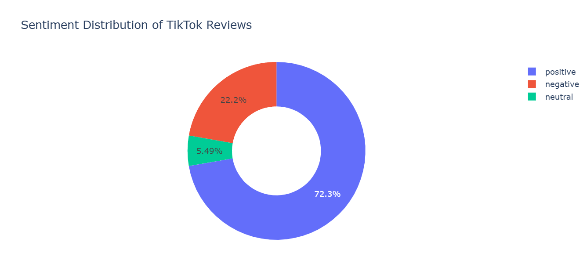
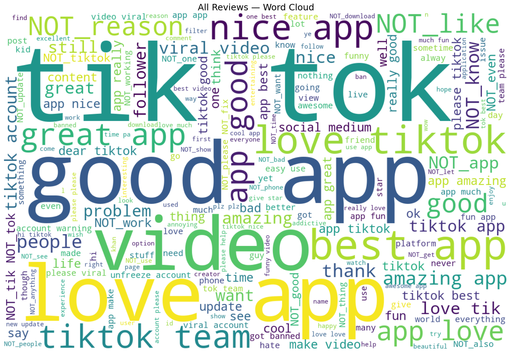

# TikTok Google Play Reviews Sentiment Analysis

## Project Overview

This project analyzes **TikTok reviews from Google Play Store** using **Natural Language Processing (NLP)** techniques.
The goal is to explore **user opinions, sentiment distribution, and common topics** mentioned in the reviews.

The analysis includes:

* Data cleaning and preprocessing
* Converting review scores to sentiment labels
* Text preprocessing and normalization
* Sentiment analysis using **VADER**
* Visualization using **Plotly, Matplotlib, and WordCloud**

The dataset contains **460,287 TikTok reviews**, which are cleaned and reduced to **287,278 valid reviews** after removing duplicates and missing values.

---

# Project Workflow

```
Dataset
   ↓
Data Cleaning
   ↓
Convert Score → Sentiment
   ↓
Text Preprocessing
   ↓
Exploratory Data Analysis
   ↓
Word Cloud Visualization
   ↓
VADER Sentiment Analysis
   ↓
Visualization of Sentiment Results
```

---

# Step 1 — Install Required Libraries

Install the required Python libraries:

```bash
pip install pandas matplotlib plotly wordcloud nltk beautifulsoup4 contractions tqdm
```
or 
```bash
pip install -r requirements.txt```
---

# Step 2 — Import Libraries

Import all required libraries.

```python
import pandas as pd
import matplotlib.pyplot as plt
import plotly.express as px
from wordcloud import WordCloud, STOPWORDS

import re
import nltk

from bs4 import BeautifulSoup
import contractions

from nltk.corpus import stopwords
from nltk.stem import WordNetLemmatizer
from nltk.sentiment.vader import SentimentIntensityAnalyzer
```

Download required NLTK resources:

```python
nltk.download("stopwords")
nltk.download("wordnet")
nltk.download("vader_lexicon")
```

---

# Step 3 — Load Dataset

Load the TikTok Google Play reviews dataset.

```python
data = pd.read_csv("tiktok_google_play_reviews.csv")
```

Keep only relevant columns:

```python
data = data[["content", "score"]]
```

---

# Step 4 — Data Cleaning

Check and remove duplicate reviews:

```python
data = data.drop_duplicates()
```

Remove missing values:

```python
data = data.dropna().reset_index(drop=True)
```

After cleaning, the dataset contains:

```
287,278 reviews
```

---

# Step 5 — Convert Score to Sentiment

Google Play ratings range from **1 to 5**.
We convert them into **three sentiment classes**.

| Score | Sentiment |
| ----- | --------- |
| 1–2   | Negative  |
| 3     | Neutral   |
| 4–5   | Positive  |

```python
def convert_sentiment(score):

    if score <= 2:
        return "negative"
    elif score == 3:
        return "neutral"
    else:
        return "positive"

data["sentiment"] = data["score"].apply(convert_sentiment)
```

---

# Step 6 — Text Preprocessing

To prepare text for analysis, the following steps are applied:

* Remove HTML tags
* Expand contractions (e.g., "don't" → "do not")
* Remove emojis and URLs
* Remove punctuation
* Convert to lowercase
* Remove stopwords
* Apply lemmatization
* Handle negation words (e.g., NOT_like)

Example preprocessing:

```
Original:  "Great fun app so far!"
Cleaned:   "great fun app far"
```

Apply preprocessing:

```python
from tqdm import tqdm
tqdm.pandas()

data["clean_content"] = data["content"].apply(preprocess_text)
```

---

# Step 7 — Sentiment Distribution Visualization

Visualize sentiment distribution using **Plotly pie chart**.

```python
sentiment_counts = data["sentiment"].value_counts().sort_index()

fig = px.pie(
    names=sentiment_counts.index,
    values=sentiment_counts.values,
    hole=0.5,
    title="Sentiment Distribution of TikTok Reviews"
)

fig.show()
```



---

# Step 8 — Word Cloud Visualization

### Overall Word Cloud

```python
all_text = " ".join(data["clean_content"])

wordcloud = WordCloud(
    stopwords=set(STOPWORDS),
    background_color="white",
    width=1200,
    height=800
).generate(all_text)
```

This shows **most frequent words in all TikTok reviews**.



---

### Positive Reviews Word Cloud

Displays common words in **positive reviews**.

---

### Negative Reviews Word Cloud

Displays common words in **negative reviews**.

These visualizations help identify **what users like or dislike about the app**.

---

# Step 9 — Sentiment Analysis Using VADER

The **VADER sentiment analyzer** evaluates the sentiment of each review.

Important note:

* VADER works best on **original text**
* Cleaned text is used for **word cloud and NLP tasks**

```python
sid = SentimentIntensityAnalyzer()

data["Positive"] = [sid.polarity_scores(i)["pos"] for i in data["content"]]
data["Negative"] = [sid.polarity_scores(i)["neg"] for i in data["content"]]
data["Neutral"]  = [sid.polarity_scores(i)["neu"] for i in data["content"]]
data["Compound"] = [sid.polarity_scores(i)["compound"] for i in data["content"]]
```

---

# Step 10 — Generate Sentiment Labels

Using VADER compound score:

| Compound Score | Sentiment |
| -------------- | --------- |
| ≥ 0.05         | Positive  |
| ≤ -0.05        | Negative  |
| otherwise      | Neutral   |

```python
data["Sentiment_Label"] = data["Compound"].apply(
    lambda c: "Positive" if c >= 0.05 else ("Negative" if c <= -0.05 else "Neutral")
)
```

---

# Step 11 — Sentiment Results

Example output:

```
Positive : 152,594
Neutral  : 97,654
Negative : 37,030
```

This shows that **most TikTok reviews are positive**.

---

# Step 12 — Sentiment Visualization

Visualize sentiment results using a bar chart.

```python
label_counts = data["Sentiment_Label"].value_counts()

fig = px.bar(
    x=label_counts.index,
    y=label_counts.values,
    color=label_counts.index,
    title="Review Sentiment Distribution"
)

fig.show()
```

---

# Key Insights

* Most TikTok reviews are **positive**
* Neutral reviews are also common
* Negative reviews represent a smaller portion
* Word clouds reveal common topics users mention

---

# Dataset

Dataset: **TikTok Google Play Reviews**

Fields used:

| Column  | Description      |
| ------- | ---------------- |
| content | User review text |
| score   | Rating (1–5)     |

---

# Technologies Used

* Python
* Pandas
* NLTK
* WordCloud
* Plotly
* Matplotlib
* BeautifulSoup

---

